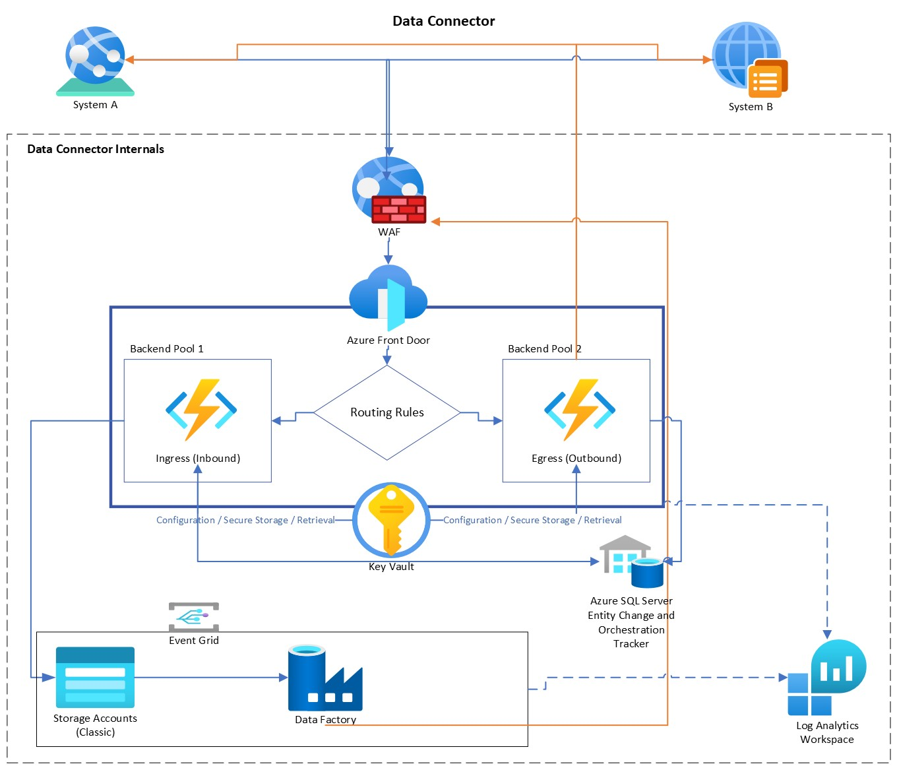

# API to API Data Connector

The following diagram represents an azure cloud method for handling data between API's. This can help aid with on-premise customer installations by leveraging Microsoft Azure.

------



------

### Goal
To create a flexible, secure, data connector component using Microsoft Azure services utilizing separation of concerns with proper logging and auditing mechanisms. 

> Note: The entirety of this design is based on serverless architecture which allows for horizontal scalability. This is intended to be predominantly configured and setup using an IaC such as Terraform or Pulumi. Using IaC also allows for quick spin-up and teardown.


### Architectural Infrastructure Identified (AII)
- Azure FrontDoor ```Routing and Caching```
- WAF ```Firewall Rules and Protection```
- Azure Functions (serverless) ```Inbound and Outbound API methods```
- Azure SQL Database (for change tracking)  ```Internal tracking mechanism for entities and orchestrations```
- Event Grid ```Event handler for internal events and resource triggering```
- Azure Storage Accounts ```Payload storage and custom retention policies```
- Azure Key Vault ```Secure storage of sensitive information or cerificates for data connector handshakes```
- Azure Data Factory ```Data Transformations, if and where applicable```
- Log Analytics Workspace  ```Logging and auditing mechanism for all infrastructure```


### Identified Resources Needed (IRN)
- Azure CLI ```needed for Pulumi to authenticate and spin up infrastucture, also just good to have```
- Pulumi CLI, Terraform (or ARM / Bicep since this is Azure Based) ```handler of resource creation/destruction```
- Azure Subscription ```A valid account that allows resource creation/destruction```


### Color Keys
- Blue ```Ingress, Inbound Infrastracture Calls / Triggers```
- Orange ```Egress, Outbound Infrastructure Calls / Triggers```

### Considerations
- This can be improved upon, I need to add the 10,000ft overview of how this is intended to work and the purpose of it's design being as it is.
- This can be simplified in smaller settings / requirements ```you can do a down and dirty data connector that doesn't require all of this which may allow faster go-to-market```
- This diagram is considered currently to be in it's infancy and provide a model that helps understand the flow of data and how these architectural items can cooperate.